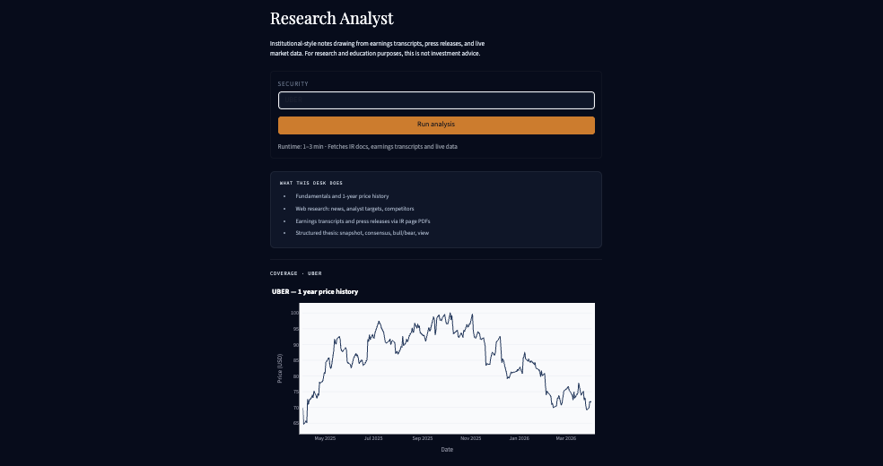
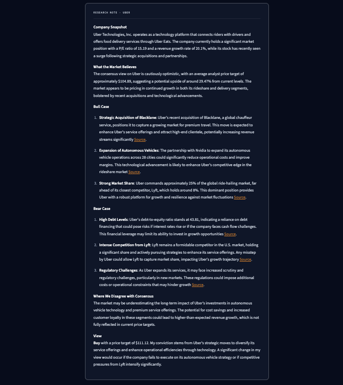

# Equity Research Agent

An agentic AI pipeline that produces institutional-style investment thesis notes by autonomously retrieving and synthesizing primary financial sources, including earnings transcripts, press releases, investor presentations and live market data.

---

## What it does

Given a stock ticker, the agent navigates the company's investor relations page, retrieves the most recent earnings documents, searches for news and analyst sentiment, and synthesizes everything into a structured investment thesis with cited sources.

The output mirrors the format of a buy-side research note: company snapshot, consensus view, bull case, bear case, a contrarian view, and a final recommendation with price target.

---

## Architecture

```
Ticker input
    │
    ├── yfinance → fundamentals (P/E, margins, revenue growth, 52w range)
    │
    ├── Playwright + Stealth → navigates Cloudflare-protected IR pages
    │       └── extracts direct PDF links to earnings docs
    │
    ├── PDF fetcher (pdfplumber) → reads earnings transcripts,
    │       press releases, prepared remarks
    │
    ├── Web search (DuckDuckGo) → recent news, analyst targets,
    │       competitor market share, fallback transcripts
    │
    ├── Webpage fetcher (BeautifulSoup) → reads HTML-based
    │       transcripts (Motley Fool, Apple Newsroom etc.)
    │
    └── LangChain Agent (GPT-4o-mini) → orchestrates all tool calls,
            synthesizes output into structured thesis
                │
                └── Streamlit UI → price chart + cited research note
```

---

## Output structure

- **Company Snapshot**:  two-sentence business and market position summary
- **What the Market Believes**: current consensus and what is priced in
- **Bull Case**: 3 specific, sourced reasons the market may be underestimating the company
- **Bear Case**: 3 company-specific risks grounded in retrieved data
- **Where We Disagree with Consensus**: the single most important mispricing
- **View**: Buy / Hold / Sell with price target and conviction reasoning
- **Sources**: all URLs retrieved during analysis

---

## Example output

**Input**


**Output**

---

## Setup

**1. Clone the repo**
```bash
git clone https://github.com/anyacui/equity-research-agent
cd equity-research-agent
```

**2. Install dependencies**
```bash
pip install langchain langchain-openai langchain-community yfinance \
    duckduckgo-search ddgs streamlit plotly pdfplumber beautifulsoup4 \
    requests playwright playwright-stealth python-dotenv markdown
playwright install chromium
```

**3. Add your OpenAI API key**
```bash
# Create a .env file
echo "OPENAI_API_KEY=sk-..." > .env
```

**4. Run**
```bash
streamlit run app.py
```

---

## Tech stack

| Layer | Tools |
|---|---|
| Agent orchestration | LangChain, OpenAI GPT-4o-mini |
| IR page navigation | Playwright, playwright-stealth |
| Document retrieval | pdfplumber, BeautifulSoup, requests |
| Market data | yfinance |
| Web search | DuckDuckGo (ddgs) |
| UI | Streamlit, Plotly |
| Language | Python 3.10+ |

---

## Limitations

- IR page navigation works for most large and mid-cap US listed companies. Some companies with heavily JavaScript-rendered IR pages may fall back to web-based transcript sources.
- Analysis is based on publicly available information only.
- Not investment advice.

---

## Planned extensions

**RAG pipeline** : currently documents are truncated at 8,000 characters. 
The next version will chunk documents, embed them with OpenAI embeddings, 
store in ChromaDB, and retrieve only the sections most relevant to each 
section of the thesis.

**Multi-agent debate** : a second analyst agent will independently form a 
view, then both agents will debate their conclusions before producing a 
final reconciled thesis. This stress-tests the bull and bear cases and 
reduces confirmation bias in the output.

**Expanded document sources** : currently retrieves earnings transcripts 
and press releases. Planning to add 10-K MD&A sections via SEC EDGAR API 
and investor day presentation slides.

---

## Author

Anya Cui — [github.com/anyacui](https://github.com/anyacui)